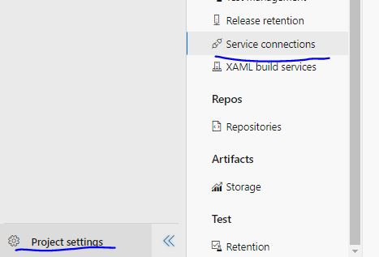
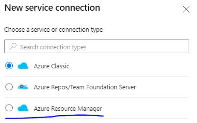
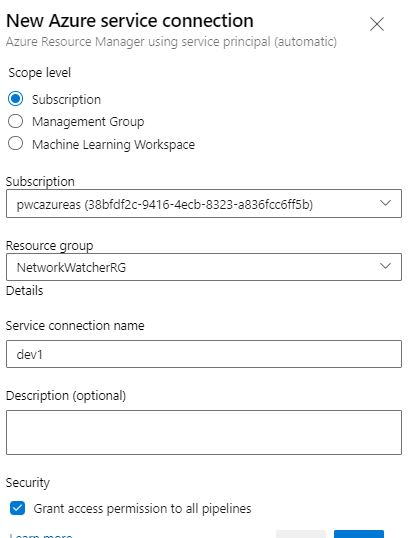
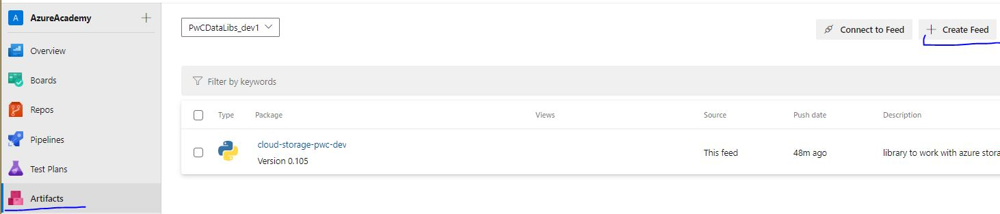
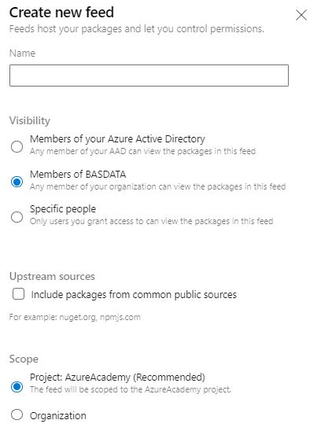
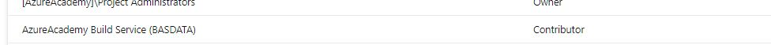

### Infrastruktura

1. Utworzenie na subskrypcji Azure - Resource Group dla komponentow pod strone www z dokumentacja
2. Utworzenie na subskrypcji Azure - Resource Group dla tymczasowych komponentow StorageAccount ktore sa tworzene na czas wdrozenia (moze byc ta sama co w punkcie 1)

3. W ustawieniach projektu [Project Settings] przechodzimy do [Service connections]  

4. Zeby nasz Azure Devops mial mozliwosc wykonywania operacji na subskrypcji klikamy w prawej gornej czesci ekranu [New service connection]

5. Otwiera sie nam okno z szablonami polaczen wybieramy [Azure Resource Manager] -> Tworzy nam automatycznie uzytkownika w Active Directory [Service principal(automatic)]   

6. Ostatnim krokiem jest wybranie subskrypcji oraz resource group-y ktore chcemy przeznaczyc na rozwiazanie,nazywamy to polaczenie oraz zaznaczamy opcje security (pipelines mialy mozliwosc wykorzystania tego polaczenia)  
 

7. Jezeli chcemy utworzyc oddzielna resource Group-e dla testowanych Storage Account,powtarzamy dla nowego polaczenia

### Utworzenie repozytorium

1. W Azure DevOps przechodzimy do Artifacts i klikamy w CreateFeed  

2. Wybieramy nazwe oraz inne ustawienia jak kto ma dostep oraz czy maja zostac dodane inne publiczne repozytoria do naszego (domyslnie wybrac opcje jak na zdjeciu)  

3. W celu udostepnienia naszego feed (repozytorium paczek) procesom wdrozeniowym nalezy przejsc w opcje (zebatka w prawym gornym rogu)->zakladka Permissions

4. Musimy dodac uzytkownika AzureAcademy Build Service (BASDATA) z uprawnieniami Contributor

