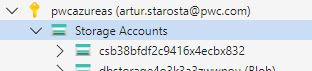
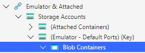
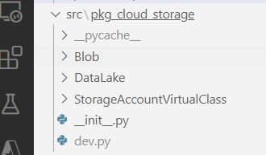
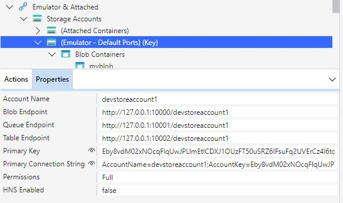

### 1. Posiadanie developerskiego Azure Storage Accout
    - utworzenie wlasnego StorageAccount na subskrypcji Azure
    lub
    - zainstalowanie lokalnego emulatora uslugi Azure Storage Account https://learn.microsoft.com/pl-pl/azure/storage/common/storage-use-emulator 
    Uwaga
    emulator nie symuluje dzialania uslugi DataLake(hierarchical namespace) tylko blobs.

    Na pwc-owym laptopie usluga uruchamia sie automatycznie i nie trzeba wywolywac koment init/start (do ktorych potrzeba administratorskie uprawnienia)
    

    Najlepiej pracowac z Storage Account za pomoca aplikacji Azure Storage Explorer https://azure.microsoft.com/en-us/products/storage/storage-explorer/

    Po wybraniu sposobu laczenie sie z Storage w aplikacji Azure Explorer powinnismy widziec opcje: 
    
    dla opcji portal


    dla opcji emulator


### 2. Plik developerski uruchamiajacy metody z paczki

    Nalezy utworzyc wlasny plik w folderze pkg_cloud_storage
    plik musi zawierac w nazwie 'dev', dzieki temu do naszego repozytorium plik nie bedzie dodawany i bedzie istanial tylko na lokalnym dysku.


### 3. Zawartosc pliku dev
    W pliku musimy zaimportowac modul ktory zmienilismy i chcemy uruchomic
```
    from Blob import Blob
    o = Blob("http://127.0.0.1:10000/devstoreaccount1",  "Eby8vdM02xNOcqFlqUwJPLlmEtlCDXJ1OUzFT50uSRZ6IFsuFq2UVErCz4I6tq/K1SZFPTOtr/KBHBeksoGMGw==")
    o.move_folder("conteiner1","path1","conteiner2","path2")
```
    Uwaga
    Klucz do symulowanego Storage Account znajdziemy w usludze Storage Explorer

